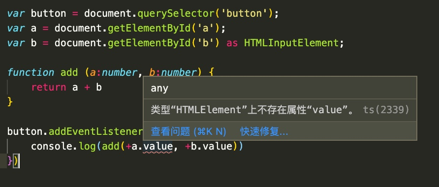
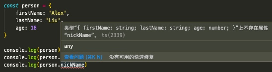

# TypeScript
- TypeScript 入门, 基础语法
- [TypeScript 官网 typescriptlang.org](https://www.typescriptlang.org/)
- 视频教程
    - [【慕课】2小时极速入门 TypeScript](https://www.imooc.com/learn/1306)
    - [基于TypeScript从零重构axios](https://www.bilibili.com/video/BV13T4y1J74J)
    - [2020千锋TypeScript全套视频（程序员必备）](https://www.bilibili.com/video/BV1jJ411X7bi?p=1)
- 小技巧
    - [ts和vscode设置中文错误提示](https://blog.csdn.net/promiseCao/article/details/109578886)
        - vscode设置中文错误提示需要打开设置页面，搜索“typescript local”，然后设置中文就行了
----
- 提示
    - 在项目中的 `pageage.json` 里
        - 如果有 `@types/...` 开头的依赖包, 如: `'@types/react-native-vector-icons': '^6.4.1'` 
        - 这种是 `第三方库 的 类型声明` 
        - 只有我们使用了这种 `第三方库 的 类型声明`， 当我们在 IDE 中编写代码的时候，这个组件 `有那些属性是必选的、那些属性是可选的、它的类型是什么？`
        - 这样编辑器 才能给我们 `提示 对应的信息`, 减少错误的发生, 减少BUG
----

- 目录
    - [第1章 TypeScript简介](#第1章-TypeScript简介)
        - [1-1 TypeScript简介](#1-1-TypeScript简介)
            - [1-什么是TypeScript](#1-什么是TypeScript)
            - [2-TypeScript-的历史](#2-TypeScript-的历史)
            - [3-TypeScript-出现的原因](#3-TypeScript-出现的原因)
            - [4-TypeScript-的作用](#4-TypeScript-的作用)
        - [1-2 TypeScript 的优点和缺点](#1-2-TypeScript-的优点和缺点)
        - [1-3 安装使用 TypeScript](#1-3-安装使用-TypeScript)
    - [第2章 TypeScript 基础](#第2章-TypeScript-基础)
        - `string  nummber  boolean  null  undefined  enum  symbol  any`
        - [2-1.TypeScript 数据类型分类](#2-1TypeScript-数据类型分类)
        - [2-2.Number, Boolean, String](#2-2Number-Boolean-String)
        - [2-3.Array数组 和 Tuple元组](#2-3Array数组-和-Tuple元组)
        - [2-4.Union联合 和 Literal类型](#2-4Union联合-和-Literal类型)
        - [2-5.Enum枚举](#2-5Enum枚举)
        - [2-6.Any 和 Unknown](#2-6Any-和-Unknown)
        - [2-7 Void Undefined Never](#2-7-Void-Undefined-Never)
        - [2-8 类型适配 (类型断言) Type Assertions](#2-8-类型适配-类型断言-Type-Assertions)
        - [2-9 函数类型](#2-9-函数类型)
            - 参数约束，返回值约束
        - []()
    - [第3章 TypeScript 面向对象](#第3章-TypeScript-面向对象)
        - [3-2 接口 Interface](#3-2-接口-Interface)
            - [高内聚, 低耦合](#高内聚-低耦合)
            - `可选属性、只读属性、任意属性`
        - [3-3 Class 类](#3-3-Class-类)
            - [class 类的修饰符 `public, private, protected, static`](#class-类的修饰符)
        - [3-6 Generics 泛型](#3-6-Generics-泛型)
            - 不预先指定具体类型，而在使用的时候再指定类型的一种特性
    - [第4章 数组类型](#第4章-数组类型)
        - 数组表示法 `array[], Array<elemType>, 接口表示法`
    - [第6章 类型断言 (类型指定)](#第6章-类型断言-类型指定)
        - 语法: `value as string , num as boolean`
    - [第7章 类型别名](#第7章-类型别名)
        - `type Name = string | number`
    - [第8章 枚举 enum](#第8章-枚举-enum)
        - `enum Days { Sun, Mon, Tue, Wed, Thu, Fri, Sat }`
    - [第9章 class 类的修饰符](#第9章-class-类的修饰符)
        - `public、private、protected、static`
    - []()

----
# 第1章 TypeScript简介
- ## 1-1 TypeScript简介
    - 
    - ### 1 什么是TypeScript?
        - TypeScript 是 JavaScript 的一个 `超集`
        - 基于 `ES6 的语法`
        - 提供 `类型系统` （这也是它之所以称之为 `TypeScript` 的原因）
        - > 注意: TypeScript 无法在浏览器中运行, 所以 TypeScript 要经过 编辑 (Compile) 成为 JavaScript 才行
        - 
        <br><br>

    - ### 2 TypeScript 的历史
        - 它由Microsoft开发，代码开源与Github上
        - 微软在 2012年10月份 发布了 TypeScript 公开版本
        - > 目标是用于 **`开发大规模`** JavaScript 应用, 更强大、更健壮、更容易维护 的大型项目
    - ### 3 TypeScript 出现的原因
        - 由于 JavaScript 是 `弱类型语言`
        - 在代码执行之前 变量的类型是不确定的
            - 它的`好处是 灵活`
            - 坏处是 项目变大 之后，会增加程序员的负担，因为在我们使用 某一个属性、变量的时候，我们 **`无法确定变量当前的类型`**，这样会导致很多BUG
            - 这也是微软 要开发 TypeScript 的原因之一
    - ### 4 TypeScript 的作用
        - TypeScript 提供超集编译期 类型检查
        - 增强了 编辑器 和 IDE 的功能
        > 在编译期 就暴露问题 <br>
        > 让问题尽早暴露，而不是等到 上线之后才 暴露问题. ( **`减小 问题的影响范围`** )
    - ### JavaScript 命名梳理
        - JavaScript 是 1994年诞生的，作者命名时 借用了 但是比较火的 Java语言 的名字, 但是 JavaScript 和 Java 没有一毛钱关系
        - JavaScript 是由 `ECMA International` (爱玛国际) 负责维护版本
            - 所以 JavaScript 也被称为 `ECMAScript`, 简称 `ES`
            - 所以 `ES` 指的是 JavaScript 的 `标准/版本`
                - 例如, `ES3、 ES5`, 支持目前所有主流浏览器
                    - > 说句题外话, ES4 这个版本 从来就没推出过, 这个版本失败了, 所以 ECMAScript 就放弃这个版本了
                - `ES6 = ES2015`, 目前浏览器不支持, 但未来一定会支持
                    - ES6 是一个颠覆性的版本, 从这个版本开始 从语言底层开始 支持 let、const, 面向对象, 模块... 等特性
                    - ECMAScript 也从 ES6 开始决定 以后的版本命名 使用年份来命名, 如 `ES2015`
                - ES2016 (ES7)
                - ES2017 (ES8)

- ## 1-2 TypeScript 的优点和缺点
    - ### TypeScript 的优点 - `Typing 强类型`
        - 0.**`类型推演 与 类型匹配`**
        - 1 规范我们的代码。TypeScript 增加了代码的`可读性`和`可维护性`
            - TypeScript 主要增加了 `类型系统`
                - 它就是最好的文档，大部分函数 我们只要看一下 类型的定义，就知道 应该如何去调用它
            - 能像Java一样 对变量类型做约束，使得代码更严谨
        - 2 在 `编译阶段` 就可以发现大部分错误
            - 这可以帮助我们 减少很多的BUG
        - 3 TypeScript 非常包容
            - 举个例子
            ```ts
            // hello.ts

            console.log('hello')
            var a : string = 1 // 错误提示：不能将类型“1”分配给类型“string”
            ```
            - 但是继续执行 `tsc hello.ts`后，虽然会有错误提示，但是仍然能编译
            ```js
            // hello.js

            console.log('hello');
            var a = 1;
            ```
        - 4 TypeScript 拥有活跃的社区
        - 5 再举个例子
            - 我们在进行 `加法运算` 的时候, `a + b`
                - JavaScript 不会对 a, b变量的类型进行检查，如果是字符串就 就将字符串 相链接，如
                    ```js
                    var a = '10'
                    var b = '5'
                    console.log(a + b) // 返回 '105'
                    ```
                - 而这 在某些 时刻却是不符合 预期的 （例如我们希望做的是加法运算时），也容易导致很多的BUG
                - 所以 就衍生出了以下解决方案
                    ```js
                    function add (a, b) {
                        if (typeof a === 'number' && typeof b === 'number') {
                            return a + b
                        } else {
                            return +a + +b  // String 类型前面 放个 + 号，会自动转成 Number 类型
                        }
                    }
                    ```
                - 这就导致了 额外的工作量，和 低水平的重复 
                    - 如果没有 TS 我们使用 JS 时，每天都需要 不断的做 类型检查，这也导致了 `大量的 低水平的重复工作`
            - TypeScript 带来的好处
                - 自动进行 `类型检查`
                - 避免低级错误
                - 解放劳动力
        - 6 TeypScript 提示健全
            > **`类型推演 与 类型匹配`**
            - 当鼠标放在 `.js` 文件的 函数形参 上时
                - 
            - 当鼠标放在 `.ts` 文件的 函数形参 上时
                - 

            ```ts
            var button = document.querySelector('button');
            var a = document.getElementById('a') as HTMLInputElement;
            var b = document.getElementById('b') as HTMLInputElement;

            function add (a : number, b : number) {
                return a + b
            }

            button.addEventListener('click', () => {
                console.log(add(+a.value, +b.value))
            })
            ```
            - 关键词 `as` + 类型 ==> 强制类型转换
            - 告诉代码，我100% 确定 a 变量的类型
            - 如下
                - 没加 as 的时候
                    - 
                - 加了 as 的时候
                    - 
    - ### TypeScript 的缺点
        - 1 学习成本，需要理解一些新的知识点，如 接口、泛型、枚举
        - 2 开发成本
            - 短期内 会增加一定的开发成本
            - 但是长期来看 这些都是值得的
        - 3 第三方库可能不支持
    - ### 是否应该在项目中使用 TypeScript
        - 使用 TypeScript 带来的收益是否大于其支出
        - 就是想学习 TypeScript


- ## 1-3 安装使用 TypeScript
    - 全局安装命令 `npm i -g typescript`
    - 编译文件 `tsc hello.ts`
    - 查看TS版本 
        ```
        tsc -v
        Version 3.9.5
        ```

    - 约定文件以 `.ts` 为后缀，编写react时，以`.tsx`为后缀
    - 主流IDE中都支持TS，包括代码补全，接口提示，跳转定义，重构

# 第2章 TypeScript 基础
- ## 2-1.TypeScript 数据类型分类
    - [【文档】Basic Types](https : //www.typescriptlang.org/docs/handbook/basic-types.html)
    - ### 基础类型 Basic Types
        ```
        string  nummber  boolean  null  undefined  array  object  symbol

        enum  tuple  void  never any
        ```
    - ### 高级类型
        ```
        union 组合类型

        Nullable 可空类型

        Literal 预定义类型

        ...
        ```
    - 空值一般采用 `void` 来表示，void可以表示变量，也可以表示函数返回值
    - 举例
    ```ts
    var str : string = 'hello'
    var num : number = 1
    var flag : boolean = true
    var un : undefined = undefined
    var nul : null = null

    str = 1             // 这会报错
    str = null          // 不会报错
    str = undefined     // 不会报错
    // 因为 null 和 undefined 是其它类型的子类型


    // void 用来规定函数无返回值
    var callback = function () : void {
        return 1    // 报错：不能将类型“1”分配给类型“void”
    }

    var num2 : void = 3 // 报错: 不能将类型“3”分配给类型“void”
    ```

- ## 2-2.Number, Boolean, String
    - Number 数字类型
        - TypeScript 对数字的定义 只有一个很笼统的 number 来表示 (基于JS的灵活性 继承过来的)
        - 既能表示 `整数`、也能表示 `浮点数`，甚至也可以表示 `正负数`
        - 例如：`1, 5.3, -10`
        - 举例
            ```ts
            let num1: number = 5 // 显式指定类型
            let num2 = 1         // 自动进行 类型推断
            ```
    - String 字符串类型
        - ```"hello", '  hello', `hello` ```
        - 反引号: ``` `` ```, 可以创建一个字符串模版
        - 与 JavaScript 一致

        - 举例
            ```ts
            let firstName: string = '阿雷克斯'
            let str = `我叫${firstName}`
            ```
    - Boolean 布尔类型
        - 真假 `true, false`
        - 处理判断逻辑
        ```ts
        let isTrue = true
        let isFalse: boolean = false
        ```
- ## 2-3.Array数组 和 Tuple元组
    - Array 数组类型
        - `[]`
        - 数组中 可以存放 `任意类型的数据`
        - JS中数组的宽容度非常大，而TS也 很好的继承了这一点
        - 举例
            ```ts
            let list1 = [1,2,3,4]           // 会自动进行 类型推断
            let list2: number[] = [1,2,3,4]
            let list3: Array<number> = [1,2,3,4]
            // 这三种声明方式完全等价，都是声明 一个 number 类型的 数组


            // 声明 任意类型 数组
            let list4 = [1, 'ddd']  // 不显式指定类型, 但是 声明变量的同时 赋值不同类型 给数组。鼠标放到变量上 会显示 let list4: (string | number)[]
            let list5: any[] = [1, 'dds', true]  // 显式声明 任意类型 数组
            ```
    - tuple 元组类型
        - 读音: Tiu破，踏破 [ˈtjʊpəl; ˈtʌpəl]
        - 元组 是一个特殊的 数组, 它是 **`固定长度，固定类型`** 的
        - 声明元组时，一定要指明数据类型
        - 举例
            ```ts
            // 元组 tuple
            let person: [number, string] = [1, 'alex']
            
            // 鼠标 hover 上去，显示 let person: [number, string]

            person[0] = 'ddd'  // 不能将类型“string”分配给类型“number”
            person[1] = 1      // 不能将类型“number”分配给类型“string”
            person[2] = 111    // 不能将类型“111”分配给类型“undefined”
            ```
        - 那么这个 固定长度 固定类型 的元组 有什么好处呢？
            - 如果这个 person 用于存放学生
                - 那么我们可以 `person[0]` 用于存放 学号
                - `person[0]` 用于存放 学生姓名
                - 这样 就自然形成了 `key - value` 的键值对 对应关系
                - 非常有利于 我们在代码中 进行逻辑判断 和 数据处理
        - 注意: tuple 现在还存在 **`BUG`**
            ```ts
            person[2] = 3   // 取下标为2的值, 这样 会报错

            person.push(3)  // 这样不会报错, IDE 和 编译 都可以通过

            // 这里是 有问题的，因为 person 已经固定 长度了，是2个长度，但是现在又可以 放3个元素 在里面
            ```
        - 声明元组时，一定要指明数据类型
            - 如
            ```ts
            let person2 = [1, 'alex']  // let person2: (string | number)[]
            // 否则，我们声明后发现 person `变成 数组` 了
            
            person2[0] = 'ddd'  // 都可以正常赋值
            person2[1] = 1      // 都可以正常赋值
            person2[2] = 111    // 都可以正常赋值
            ```

- ## 2-4.Union联合 和 Literal类型
    - ### Union 联合类型
        - 一个变量 可以同时支持 两个 甚至多个 不同的 类型
            ```ts
            let union : string | number

            union = 2
            union = 'alex'
            union = true    // 不能将类型“boolean”分配给类型 “string | number”


            let union2 : number | string | boolean | string[]
            ```
        - 只能访问此联合类型内的所有类型里共有的属性和方法
            ```ts
            var muchtype3 : string|number = 'hello'

            console.log(muchtype3.length)  // 无报错

            muchtype3 = 2
            console.log(muchtype3.length)  // 报错: 类型“number”上不存在属性“length”
            console.log(muchtype3.toString())  // toString() 方法 number 和 string 都支持
            
            // 只能访问此联合类型内 都支持的属性和方法
            ```
        - 例2
            - 先看一下 之前的一个 加法函数
                ```ts
                function merge (n1: number, n2: number) {
                    return n1 + n2
                }

                let mergeNumber = merge(2, 5)
                ```
            - 如果我们希望拓展一下这个函数，希望它 既可以 `做加法`，也可以做 `字符串合并`。 改如何做呢？
                ```ts
                function merge (n1: number | string, n2: number | string) {
                    if (typeof n1 === 'string' || typeof n2 === 'string')
                        return n1.toString() + n2.toString()
                    else
                        return n1 + n2
                }

                let mergeNumber = merge(2, 5)               //  7
                let mergeString = merge('hello', 'world')   //  helloworld
                ```
        - **`确定值的 联合 Union`**
            ```ts
            let union : 0 | 1 | 2   // 确定值的联合，一旦 指定之后, 该变量 就只能取 这3个值 中的一个

            union3 = 4  // 不能将类型“4”分配给类型 “0 | 2 | 1”

            // 那么 像这种 明确取值的类型 就是 字面量类型 Literal
            ```
    - ### Literal 字面量类型
        ```ts
        let number3 = 4

        let union : 0 | 1 | 2
        
        let literal : 1 | '2' | true | [1,2,3,4]
        ```
        > 当我们把 字面量类型 和 联合类型 结合起来使用的时候，就能够产生 **`非常强大的 代码逻辑`**
        ```ts
        // 我们再来改造一下 上面的 加法函数
        function merge (
            n1: number | string,
            n2: number | string,
            resultType: 'as-number' | 'as-string'
        ) {
            if (resultType === 'as-string') {
                return n1.toString() + n2.toString()
            }
            if (typeof n1 === 'string' || typeof n2 === 'string')
                return n1.toString() + n2.toString()
            else
                return n1 + n2
        }

        let mergeNumber = merge(2, 5, 'as-number')  // 7
        let mergeNumber = merge(2, 5, 'as-string')  // 25
        let mergeNumber = merge('hello', 'world')   // helloworld
        ```

- ## 2-5.Enum枚举
    > Java, C# 语言 都有 Enum枚举类型，但是 JavaScript 没有 <br><br>
    > 虽然在 ES3 中，就把 Enum 这个关键字 保留了，但是  JavaScript 并没有 枚举这个概念，也没有真正的实用过
    - Enum 枚举类型
        - `enumerate`
        - 读音：`[ɪˌnjuːm]`, 类似于: eNum
        - 枚举类型 究竟是什么呢？下面我们来看代码
            ```ts
            enum Color {
                red,
                green,
                blue
            }

            // 使用该 枚举类型
            let color = Color.blue  // 2
            console.log(color)
            ```
            - 鼠标 hover 到 red 上
                - 
            - > 默认情况下，枚举类型 **`真正的类型`** 是 `Number `   (与 C++ 非常类似)
                ```ts
                // 默认情况下
                enum Color {
                    red,        // 0
                    green,      // 1
                    blue        // 2
                }
                ```
        - 指定数据
            - 当然，除了默认情况下，我们还可以 指定数据，如
                ```ts
                enum Color {
                    red = 5,    // 5    // 手动指定 从5开始 计算, 而不是默认的 0 开始计算
                    green,      // 6
                    blue        // 7
                }

                // 这种特性 与 C++ 也完全一致
                ```
            - 我们还可以
                ```ts
                enum Color {
                    red = 5,        // 5
                    green = 10,     // 10
                    blue =  1       // 1
                }
                ```
            - 还可以 指定 别的数据类型
                ```ts
                enum Color {
                    red = 'red',        // 'red'
                    green = 'green',    // 'green'
                    blue =  1           // 1
                }
                ```
    > 总结: TypeScript 的 Enum 枚举类型 非常强大，配合 Switch 语句 非常好用

    - 例2
        - 1.枚举 (enumerate) 类型用于取值被限定在一定范围内的场景
            - 关键字: enum
            - 例如: `enum Days { Sun, Mon, Tue, Wed, Thu, Fri, Sat }`
            - 枚举成员会被赋值为 从0开始递增的数字, 同时也会被 `枚举值` 到 `枚举名` 进行反向映射
        ```ts
        enum Days {
            Sun,
            Mon,
            Tue,
            Wed,
            Thu,
            Fri,
            Sat
        }

        console.log(Days.Sun)   // 0
        console.log(Days.Sat)   // 6
        console.log(Days[0])    // Sun


        console.log(Days)    // 枚举类型 最终会被编译成 双向映射的对象

        // { '0': 'Sun',
        //   '1': 'Mon',
        //   '2': 'Tue',
        //   '3': 'Wed',
        //   '4': 'Thu',
        //   '5': 'Fri',
        //   '6': 'Sat',
        //   Sun: 0,
        //   Mon: 1,
        //   Tue: 2,
        //   Wed: 3,
        //   Thu: 4,
        //   Fri: 5,
        //   Sat: 6 }


        // 使用枚举类型可以定义一些有名字的数字常量
        enum Days2 {
            Sun = 3,      // 给定初始默认值, 下面会按顺序递增
            Mon,
            Tue,
            Wed,
            Thu,
            Fri,
            Sat
        }

        console.log(Days2.Sun)   // 3
        console.log(Days2.Sat)   // 9

        console.log(Days2)
        // { '3': 'Sun',
        //   '4': 'Mon',
        //   '5': 'Tue',
        //   '6': 'Wed',
        //   '7': 'Thu',
        //   '8': 'Fri',
        //   '9': 'Sat',
        //   Sun: 3,
        //   Mon: 4,
        //   Tue: 5,
        //   Wed: 6,
        //   Thu: 7,
        //   Fri: 8,
        //   Sat: 9 }

        ```

- ## 2-6.Any 和 Unknown
    - ### Any 任意类型
        ```ts
        let randomValue : any = 666
        randomValue = true
        randomValue = 'alex'
        randomValue = {}
        randomValue()               // 函数调用
        randomValue.toUpperCase()   // 属性调用

        // 因为是 任意类型 所以 上面这些用法 IDE编辑器 都不会报错

        // 但是代码编译后 并执行
        // randomValue()                // randomValue is not a function
        // randomValue.toUpperCase()    // randomValue.toUpperCase is not a function
        ```
        > &nbsp;<br>
        > 其实，我们以前使用 JavaScript 的时候，我们使用的变量 都是 Any 任意类型 <br><br>
        > 有人说 使用了 TypeScript, 就不要用 Any 类型。 不然 就失去了 TypeScript 的 **`强类型定义`** 的作用了 <br><br>
        > 使用 Any 主要是为了 :
        >   - 加速我们的开发过程, 提升效率
        >   - 避免过渡设计<br>
        > &nbsp;

        <br>

        > &nbsp;<br>
        > "为什么 JavaScript 可以流行这么多年，且经久不衰 ?"
        <br><br>
        > —— 主要还是因为 JavaScript 的灵活性 <br>
        > - 我喜欢 JavaScript, 正是它 无与伦比 的灵活性
        > - 我不喜欢 JavaScript, 我痛恨的, 也正是它的灵活性<br>
        > &nbsp;

        <br>

        > &nbsp;<br>
        > JavaScript 的这种 野蛮生长, 高灵活性, 在带给我们团队 **`快速开发产品`** 的同时, <br><br>
        > 也带来了 :
        > - 不可阅读性、
        > - 不可维护性、
        > - 不可拓展性
        > - ... 
        > - 等一系列的问题<br><br>
        > &nbsp;
        
        > &nbsp;<br>
        > 而 TypeScript 正是 因为有了 Any 这个类型, 
        > - 才使得 TypeScript 在继承了 JavaScript **`高灵活性`** 的同时, 
        > - 还能带来 **`强类型语言`** 才能形成的 **`高可维护性`** <br>
        > &nbsp;

        > &nbsp;<br>
        > 何时使用 Any 类型 ?
        > - 当我们懒得定义 **`复杂类型结构`** 的时候 <br>
        > - 就使用 Any 类型 <br>
        > &nbsp;

    - ### Unknown 未知类型
        - 当我们把上面的代码 改为 unknown 的时候, IDE 编辑器 就会报错了
        - 
        > &nbsp;<br>
        > Unknown **`不保证类型`**, 但是 **`保证类型安全`** <br>
        > &nbsp;

        > &nbsp;<br>
        > 在我们使用  Unknown变量 的时候
        > - 需要做 一定的判断 和 类型转换 <br>
        > - 当确定了 **`变量类型`** 之后, 才正常使用 <br>
        > &nbsp;

        ```ts
        let randomValue : unknown = 666
        randomValue = true
        randomValue = 'alex'
        randomValue = {}

        if (typeof randomValue === 'function') {
            randomValue()
        }

        if (typeof randomValue === 'string') {
            randomValue.toUpperCase()
        }

        // 确定 变量类型 后, 这样的代码 IDE 编辑器, 就不会报错了
        // 保证了 类型的绝对安全
        ```
    - 总结

        > &nbsp;<br>
        > Any
        > - 优点: 适用于 代码的 **`快速成型, 快速上线`** <br>
        > - 缺点: 会遗留 一些比较明显的 **`安全隐患`** <br>
        > &nbsp;

        > &nbsp;<br>
        > Unknown
        > - Unknown 比 Any 更保险一点, 可以 **`保证类型安全`**
        > - 也能拥有 Any 的 **`灵活性`** <br>
        > &nbsp;

- ## 2-7 Void Undefined Never
    - ### Void
        - 什么是 Void 类型
            - 
                - IDE 告诉我们, 一个函数 在没有任何返回的情况下, 返回值 就是一个 `void` 类型
            ```ts
            function printResult () : void {        // 显式指定 返回 void 类型
                console.log('lalala')
            }
            ```
        - 但是, 在JavaScript 中, 是没有 Void 类型 对应的表述的
            - > 在实际执行 代码时, void 实际上返回的是 undefined
            ```ts
            function printResult () : void {        // 显式指定 返回 void 类型
                console.log('lalala')
            }

            console.log('hello', printResult())     // hello, undefined
            ```
    - ### Undefined
        - 那么 Void 和 Undefined 有什么区别呢 ?
            - 如果我们把 函数 的返回值, 从 void 改为 undefined, IDE 就会报错
            - `A function whose declared type is neither 'void' nor 'any' must return a value.`
            - 
        - 区别
            - 它们的区别, 实际上是 在探讨 `某一个物质 是否存在的问题`
                - 虽然它们都表示 不存在
            > &nbsp;<br>
            > Undefined
            > - Undefined 是值的一个类型
            > - Undefined 说的 不存在, 指的是 物质不存在 <br>
            > - undefined 在代码中 指的是, 一个变量 声明了, 但是没有被 赋值, 则默认为 undefined <br>
            > &nbsp;

            > &nbsp;<br>
            > Void
            > - Void 连一个 值 都不是
            > - Void 说的 不存在, 是指 存在本身 不存在 <br>
            > - void 在代码中 指的是, 某个变量 根本不存在 <br>
            > &nbsp;
        - 那么 上面的代码, 我们如何修改 才能让它 既不报错, 也能返回 undefined 呢 ?
            - 加一个 `return`
            ```ts
            function printResult () : undefined {
                console.log('lalala')
                return                  // return 空值 默认返回 undefined
            }
            ```

            > 在 JavaScript 中, 是没有 Void 这个类型的 <br>
            > 在 TypeScript 中, 所有的 Void 编译成 JS 执行后, 都是返回 undefined
    - ### Never
        > **`一个函数 永远都执行不完, 这就是 never 的本质`**
        - 先看代码
            ```ts
            function throwError (message: string, errorCode: number) {
                throw {
                    message,
                    errorCode
                }
            }
            throwError('not found', 404)
            ```
        - 那么, 这个函数 是什么类型呢 ?
            - 
            - 从上图 可以得知 `throwError 函数` 默认返回 `void`
            - 但是因为我们 抛出了异常, 
                - 也就是说, 这个函数 不仅没有返回值
                - 而且 这个函数 它永远都不可能 执行完成
                    - 因为每次 执行到 throw 这里的时候，都会直接抛出异常, 函数强行结束了
                    - 也就是说, 这个函数 永远都不会 执行到 第101行
            - **`所以 这个函数 真正的类型 应该是 never`**
            - 也就是
                ```ts
                function throwError (message: string, errorCode: number) : never {
                    throw {
                        message,
                        errorCode
                    }
                }
                throwError('not found', 404)
                ```
        > **`一个函数 永远都执行不完, 这就是 never 的本质`**
        - 思考: 除了这种 `throw` 抛出异常的情况之外, 还有什么方法能够 让函数 永远保持无法执行完 的状态呢 ?
        - 答: **`while 循环`**
            ```ts
            function whileLoop () : never {
                while (true) {
                    console.log('haha')
                }
            }
            ```
        > 在实际开发中, never 是用来控制 逻辑流程的 <br>
        > 但是 工作中 不常用 <br>
        > 大部分 是用来处理异常, 或者处理 Promise 的
- ## 2-8 类型适配 (类型断言) Type Assertions
    > **注意⚠️**: 在使用 Type Assertions 类型适配 的时候, 你一定要 **`非常了解当前 变量的类型,`** 而且要对自己的 代码有 100% 的信心, **`否则 可能引发严重的错误！！！`**
    - 什么是 类型适配 ?
        举个例子
        ```ts
        let message : any
        message = 'abc'   // 这时候 message 的变量类型, 应该自动变成 string 类型 才对
        // 但是, 当我们把 鼠标 hover 在 message 变量上的时候发现, 它仍然是 any 类型

        // 这时, 当我们使用 原生 JavaScript 内建函数的时候, 如
        message.endWith('c')
        // 在输入 .endWith() 的过程中, 我们发现 编辑器 没有打开 自动联想功能
        ```
    - 为什么会这样呢？
        - 声明变量时，变量为 `any` 类型, 即使后面赋值了 字符串, 也不会改变 该变量的变量类型
        - 所以，因为 `message` 是 `any` 类型, 所以不会自动打开 编辑器的 `自动联想功能`
        - 那么，出现这种情况 我们该如何处理呢？
    - ### Type Assertions 类型适配 (类型断言)
        - 什么是 Type Assertions 类型适配 (类型断言) ？
            - 在某个时刻，我们需要明确的把 某个变量的类型 告诉 `TypeScript 编译器`
            - 而这个 通知 `TypeScript` 进行类型适配 的过程, 就叫做 **`Type Assertions 类型适配 (类型断言)`**
        - 如何使用 ?
            ```ts
            // Type Asserttions / 类型适配 / 类型断言
            let message : any
            message = 'abc'
            message.endWith('c')

            let ddd = <string>message     // 方法一, <> 尖括号
            ddd.endsWith('c')

            let ddd2 = message as string  // 方法二, as 关键字
            ddd2.endsWith('c')
            ```
        - 
    - ### 类型断言 注意⚠️事项
        - 1.类型断言 在复合类型中 可以用来手动 **指定一个值的类型**
            - 语法: `<类型>值` 或 `值 as 类型`
        - 2.在jsx语法 (React的jsx语法的ts版) 必须采用 `值 as 类型` 这种
            - 因为 `<类型>值` 这种写法带有 `尖括号<>`, 会跟其他`尖括号<>`冲突
        - 3.类型断言不是类型转换，断言成一个联合类型中不存在的类型是不允许的
        ```ts
        // 问题
        let num : number|string = '12'
        num = 10
        console.log(num.length)     // 报错: 类型“number”上不存在属性“length”


        // 类型断言
        function get (value : number|string) {
            // return value.length     // 报错: 类型“number”上不存在属性“length”
            // return (<string>value).length   // 类型断言 写法1
            return (value as string).length    // 类型断言 写法2
        }


        let num2 : number|string = '12'
        console.log((num2 as boolean).length)
        // 转联合类型中 不存在的 boolean类型，就报错
        ```

- ## 2-9 函数类型
    - TypeScript 给函数带来的 新特性
        - 1.函数约束：`参数约束，返回值约束`
        - 2.函数本身赋值变量的约束
    - TypeScript 与 JS ES6 中, 函数里的 最大区别是, `可以给 入参 指定类型`
    - 入参类型
        ```ts
        // 函数类型
        let log = function (message) { // 传统函数定义
            console.log(message);
        }

        let log2 = (message: string) => console.log(message) // ES6 箭头函数 定义
        // TypeScript 可以给 函数入参 指定类型
        log2('hello')
        log2(2)    // 传入 非指定 入参类型 会报错 // 类型“number”的参数不能赋给类型“string”的参数
        log2(true) // 传入 非指定 入参类型 会报错 // 类型“boolean”的参数不能赋给类型“string”的参数
        ```
    - 入参个数
        ```ts
        // 如果 TypeScript 定义了 2个 参数, 在调用函数的时候 必须填写 所有参数, 否则会报错
        let log3 = (message: string, code: number) => {
            console.log(message, code);
        }
        log3('hello') // 报错: 入参不够 // 应有 2 个参数，但获得 1 个
        ```
    - 可选参数
        - '?' 问号表示 可选参数
        - 如果我们希望 函数 能像 JavaScript 一样, 有的参数是 可填可不填的
            ```ts
            let log4 = (message: string, code?: number) => { // '?' 问号表示 可选参数
                console.log(message, code);
            }
            log4('hello')
            ```
    - 默认参数
        - 当使用了 可选参数, 剩下的参数没有传时, 默认为 undefined
        - 如果 不希望 其他参数 默认为 undefined, 可以使用 ES6 的 默认参数
            ```ts
            let log5 = (message: string, code: number = 0) => { // '?' 问号表示 可选参数
                console.log(message, code);
            }
            log5('hello')
            ```
    > 1.在 TypeScript 中, 可选参数 和 默认参数, 都可以实现 在调用函数时 不用输入全部参数 的功能 <br>
    > 2.不管 可选参数, 还是 默认参数, 都是要 从后往前写。 否则如果是 从左往右写 就会报错

    - 例2
        ```ts
        // 声明式函数
        function funType (name : string, age : number) : number {
            return age
        }
        var ageNum : number = funType('nick', 12)


        // 参数不确定
        function funType2 (name : string, age : number, sex? : string) : number {
            return age
        }
        var ageNum2 : number = funType2('nick', 12)


        // 参数默认值
        function funType3 (name : string='nick', age : number=18) : number {
            return age
        }
        ```
        ```ts
        var funType4 = function (name : string, age : number) : number {
            return age
        }


        // 表达式函数

        // 对于左边 funType5变量 的约束, 最终 funType5函数 的返回值是 =>number类型
        var funType5 : (name : string, age : number)=>number = function (name : string, age : number) : number {
            return age
        }


        // 接口方式约束
        interface funType6 {
            (name : string, age : number) : number
        }
        var funType6 : funType6 = function (name : string, age : number) : number {
            return age
        }
        ```
    - 3.可采用重载的方式才支持`联合类型`的函数关系
        ```ts
        // 对于联合类型的函数，可以采用重载的方式
        function getValue (value : number|string) : number|string {
            return value
        }
        // 我想要 当我输入number时 就给我返回number, 输入string时 就给我返回string,
        let a : number = getValue(1)      // a 报错: 不能将类型“string | number”分配给类型“number”
        let b : string = getValue('1')    // b 报错: 不能将类型“string | number”分配给类型“string”


        // 解决方法: 重载的方式
        function getValue1 (value : number) : number
        function getValue1 (value : string) : string
        function getValue1 (value : number|string) : number|string {
            return value
        }
        let aa : number = getValue1(1)      // a 报错: 不能将类型“string | number”分配给类型“number”
        let bb : string = getValue1('1')    // b 报错: 不能将类型“string | number”分配给类型“string”
        ```


- ## 2-2.TypeScript 中的任意值
    - 任意值 ( Any ) 用来表示允许赋值为任意类型
    - 声明一个变量为任意值后，对它的任何操作，返回的内容的类型都是任意值
    - 变量如果在声明的时候，未指定其类型，那么它就会被识别为任意值类型
    ```ts
    var num : any = 1
    num = true
    num = '3'

    var num2;  // 没有赋值操作，就会被认为任意值类型  等价于 var num2 : any;
    num2 = 1
    num2 = true
    ```
    - ### 类型推论
        - 给变量赋初始值时，如果没有声明类型，就会根据 初始值倒推变量类型
            ```ts
            var b = 1;
            b = '2'    // 不能将类型“"2"”分配给类型“number”
            ```
        - 如果定义时没有赋值，不管之后有没有赋值，都会被推断成any类型，而完全不被类型检查
            ```ts
            var num2;  // 没有赋值操作，就会被认为任意值类型  等价于 var num2 : any;
            num2 = 1
            num2 = true
            ```

# 第3章 TypeScript 面向对象
- ## 3-0 面向对象 概念
    - ### 为什么会出现面向对象, 这个概念?
        - [面向对象编程思想（OOP）的由来与本质](https://www.youtube.com/watch?v=3yNVmdkLpVQ)
        - [C的面向过程和C++的面向对象有什么区别，大象装冰箱一个例子搞懂](https://www.youtube.com/watch?v=jPctIi4CHNk)
    - 面向对象 和 面向过程 的优缺点
        - 面向过程
            - 优点
                - 性能比面向对象好, 因为类的调用 需要实例化。 `开销大、消耗资源多`
            - 缺点
                - `不易维护、不易复用、不易拓展`
        - 面向对象
            - 优点
                - `易维护、易复用、易拓展`
                - 由于 面向对象 有 `封装、继承、多态` 的特性, 可以设计出 `低耦合` 的系统
            - 缺点
                - 性能 比 面向过程 差
- ## 3-1 object 对象类型
    - ### 在 JavaScript 中的 object 对象
        - 是下面这样子的
        - `Key-Value` 键值对
            ```js
            const ojbect = {
                hello: 'world'
            }
            ```
        - JavaScript 中的 object对象 跟 JSON数据 的形式是很像的，并且 JavaScript 是原生支持 JSON 的
        - 使用 `{}` 花括号, 并且是 `键值对` 形式的, 基本上都是 Object 对象类型
            ```js
            const person = {
                firstName: 'Alex',
                lastName: 'Liu',
                age: 18
            }

            console.log(person)             // 可以 调用该对象
            console.log(person.age)         // 可以 调用 对象内的属性
            console.log(person.nickName)    // 甚至可以调用 对象内不存在 的属性 (TypeScript 中会报错, JS 中不会)
            ```
    - ### TypeScript 中的 object 对象
        - object 在 JavaScript 与 TypeScript 中的不同之处 在于
            > &nbsp;<br>
            > - JavaScript 是 `Key-Value`
            > - TypeScript 是 `Key-Type`<br>
            > &nbsp;
        ```ts
        const person = {
            firstName: 'Alex',
            lastName: 'Liu',
            age: 18
        }

        console.log(person)             // 可以 调用该对象
        console.log(person.age)         // 可以 调用 对象内的属性
        console.log(person.nickName) 
        ```
        - TypeScript 中, 初始化时 属性的类型 就已经被定义了
            - 
        - 如果调用了 不存在的属性
            - 
        - 另外, 如果把 变量类型 定义为 `any`, 就不会在报错了
            - 
    - ### 显示手动 定义对象类型
        ```ts
        const person : {
            firstName: string,
            lastName: string,
            age: number
        } = {
            firstName: 'Alex',
            lastName: 'Liu',
            age: 18
        }
        ```
        - **`注意⚠️`**: 定义为空对象
            - 此外，我们还可以 笼统的定义一下 变量类型, 也是可以的
            - 但是 这种 笼统的定义方式 不会对我们的代码 有任何的帮助
                ```ts
                const persion : object = {  // 将 person 变量 定义为 object类型
                    firstName: 'Alex',
                    lastName: 'Liu',
                    age: 18
                }

                console.log(person)             // 正常执行
                console.log(person.age)         // 类型“object”上不存在属性“age“
                console.log(person.nickName)    // 类型“object”上不存在属性“nickName“
                ```
            
            - 而且, 上面这种定义方法, 跟直接 定义为 `{}` 效果是完全一样的
                ```ts
                const persion : {} = {  // 将 person 变量 定义为 object类型
                    firstName: 'Alex',
                    lastName: 'Liu',
                    age: 18
                }

                console.log(person)             // 正常执行
                console.log(person.age)         // 类型“{}”上不存在属性“age“
                console.log(person.nickName)    // 类型“{}”上不存在属性“nickName“
                ```
            > 当我们使用 object 来定义 对象结构的时候 `const persion : object` <br>
            > TypeScript 是不知道 对象内部结构的, 类似于 `const person : {}` 定义一个变量的类型为 `空对象` <br>
            > <br>
            > 所以 上面这两种方法, 将变量 定义为 `空对象` 是非常没有必要的, 倒不如 不定义变量类型, 让 TypeScript 自动推断出 变量的 `类型定义`, 如下图一样
            - 


- ## 3-2 接口 Interface
    - 1.为什么需要 InterFace 接口 ?
        - 1.先来看个问题
            - 要求: 写一个方法，用来画出 坐标点
            ```ts
            let drawPoint (x, y) => {
                console.log({x, y})
            }
            ```
            - 思考:
                - 上面这种方式，是可以的，没问题的
                - 但是，我们想一下，一个坐标点 最好应该是 以 `整体` 的形式 来传入函数中的，而不是 分别拆开，然后再传入
                - 这里就 涉及到了 **`用 面向对象 的思想 来解决问题`** 了
            - 用 **`面向对象`** 的思想 来改造这个 解法
                - 传入的 参数, 应该是一个 包含 `x, y` 参数的 **`对象`**
                ```ts
                let drawPoint = (point) => {
                    console.log({ x: point.x, y: point.y })
                }

                drawPoint({ x: 105, y: 24 })
                ```
                - 思考:
                    - 上面这种解法，虽然 也可以解决问题
                    - 但是存在一定的 安全隐患, 如下
                ```ts
                drawPoint({ x: 'Alex', y: '刘老师' })  // 入参的时候, 传入了 字符串
                drawPoint({ wether: '干燥', temperature: '50C' }) // 入参的时候 根本没有 x y 参数 
                ```
                - 这个时候, 不管是代码逻辑, 还是业务逻辑 都 彻底的错了
        - 2.解决问题
            - 不过幸好 我们还有 TypeScript
            - 我们可以使用 Interface 面向对象 接口, 来 **`给 参数对象 point 加以限制`**
            ```ts
            interface Point {
                x: number,
                y: number
            }

            let drawPoint = (point : Point) => {
                console.log({ x: point.x, y: point.y })
            }

            drawPoint({ x: 105, y: 23 })
            drawPoint({ x: 'Alex', y: '刘老师' })
            drawPoint({ wether: 'dry', temperature: '50C' })
            ```
            > 定义好 接口之后, 那些 不符合要求的 入参就都报错了
            - 
    - ### **`高内聚, 低耦合`**
        > <br>
        > 高内聚: 功能相关的事物, 应该放在同一个集合中, 形成一个模块 <br><br>
        > 低耦合: 而这些模块 又应该是 相互独立的, 不同模块之间 应该保持 低耦合的状态 <br>
        > <br>

    - ### Interface
        - 1.可描述类的一部分抽象行为，也可描述对象的结构形状
        - 2.接口一般手写字母大写，有的编程语言上面建议接口名称加上 "I" 前缀
        - 3.赋值的时候，变量的形状必须要跟接口的形状保持一致
        - 4.接口中可定义 `可选属性、只读属性、任意属性`
        - 举例子
            - ### 3-2-1 定义接口  强约束规范
                ```ts
                // 定义接口
                interface Istate {
                    name : string
                }

                var obj : Istate
                obj = 1    // 报错: 不能将类型“1”分配给类型“Istate”
                obj = {}   // 报错: Property 'name' is missing in type '{}' but required in type 'Istate'
                        //       属性“name”在类型“{}”中缺失，但在类型“Istate”中是必需的。
                obj = {name: 'nick'}    // 无报错
                ```
            - ### 3-2-2 可选属性
                ```ts
                // 可选属性
                interface Istate2 {
                    name : string,
                    age? : number     // '?' 问号表示 存疑，可有可无：可选属性
                }
                var obj2 : Istate2
                obj2 = {name: 'no', age: 20}    // 无报错
                obj2 = {name: 'no'}             // 无报错
                ```
            - ### 3-2-3 动态属性
                - 属性个数不确定的时候，可随时添加属性
                ```ts
                // 动态属性
                interface Istate3 {
                    name : string,
                    age? : number,
                    [propName : string] : any   // 必须是any类型, propName 变量名可以随意取
                }
                var obj3 : Istate3 = {name: 'nick', age: 12, sex: 'male', isMarry: true} // 可随时添加属性
                ```
                - 问题：为什么 ` [propName : string] : any`  必须是any类型 ?
                    ```ts
                    // 动态属性
                    interface Istate4 {
                        name : string,               // name 报错：类型“string”的属性“name”不能赋给字符串索引类型“number”
                        age? : number,
                        [propName : string] : number   // 不是any类型
                                                // 跟上面类型冲突
                    }
                    ```
                    - 报错原因：因为 `name: string` 类型，跟下面的 `[propName : string] : number` 冲突了
                    - 如果改成这样
                    ```ts
                    interface Istate4 {
                        name : string,
                        age? : number,             // age 报错: 类型“number”的属性“age”不能赋给字符串索引类型“string”
                        [propName : string] : string
                    }
                    ```
            - ### 3-2-4 只读属性
                ```ts
                // 只读属性
                interface Istate5 {
                    name : string,
                    readonly age : number
                }
                var obj4 : Istate5 = {name: 'nick', age: 10}
                obj4.name = 'li'
                obj4.age = 111  // age 报错: 只读属性一旦赋值后，就不可更改
                ```
- ## 3-3 Class 类
    - [Defining Classes](https://developer.mozilla.org/en-US/docs/Web/JavaScript/Reference/classes)
        - Classes are in fact `"special functions"`, and just as you can define `function expressions` and `function declarations`, the class syntax has two components: `class expressions` and `class declarations`.
    - ### class 类的修饰符
        > Class 有4个修饰符 `public, private, protected, static`
        - `public` 修饰的 `属性` 或 `方法` 是共有的，可以做任何地方被访问到，默认所有 `属性` 或 `方法` 都是public
        - `private` 修饰的 `属性` 或 `方法` 是私有的，不能在声明它的类外面访问
        - `protected` 修饰的 `属性` 或 `方法` 是受保护的，它和 `private` 类似
        - `static` 在开发 `不依赖于内部状态` 的类函数时，最好将它们转换为静态方法

        - #### public
            - 在类的 内部和外部, 可以自由的访问类里定义的成员
            > 在TypeScript里，成员都默认为 public
            ```ts
            class Animal {
                public name: string;
                public constructor(theName: string) { this.name = theName; }
                public move(distanceInMeters: number) {
                    console.log(`${this.name} moved ${distanceInMeters}m.`);
                }
            }
            ```
            ```ts
            // 创建 Person类
            class Person {
                name = 'nick'
                age = 18
                say () {
                    console.log('my name is ' + this.name + ', my age is ' + this.age)
                }
            }

            // 创建 person 实例
            var p = new Person()
            p.say()
            console.log(p.name) // 当一个类成员变量没有被修饰的时候，外界是可以进行访问的，默认就是public进行修饰
            ```
        - #### private
            - 但是如果加了 private
            > 被标记成 private时，它就不能在声明它的类的外部访问
            ```ts
            class Animal {
                private name: string;
                constructor(theName: string) { this.name = theName; }
            }

            new Animal("Cat").name; // 错误: 'name' 是私有的.
            ```
            ```ts
            // 创建 Person类
            class Person {
                private name = 'nick'
                age = 18
                say () {
                    console.log('my name is ' + this.name + ', my age is ' + this.age)
                }
            }

            // 创建 person 实例
            var p = new Person()
            p.say()    // my name is nick, my age is 18 // 在类中, 可以正常访问 private 属性 
            console.log(p.name) // 报错: 属性“name”为私有属性，只能在类“Person”中访问
            ```
        - #### protected
            - `protected` 修饰符与 `private` 修饰符的行为很相似，但有一点不同， protected成员在派生类中仍然可以访问。
            - 当为 `private` 时, `private` 类成员不可被继承
                ```ts
                class Person {
                    private name : string
                    // protected name : string

                    constructor (name) {
                        this.name = name
                    }
                }

                class Student extends Person {
                    constructor (name) {
                        super(name)
                    }

                    public learn () {
                        console.log(`${this.name} is learning`) // 属性“name”为私有属性，只能在类“Person”中访问。
                    }
                }

                let aleax = new Student('Aleax')
                console.log(aleax.learn());
                ```
            - 当为 `protected` 时, `protected` 类成员可被继承
                ```ts
                class Person {
                    // private name : string
                    protected name : string

                    constructor (name) {
                        this.name = name
                    }
                }

                class Student extends Person {
                    constructor (name) {
                        super(name)
                    }

                    public learn () {
                        console.log(`${this.name} is learning`)  // Aleax is learning.  this.name 可以被正常访问
                    }
                }

                let aleax = new Student('Aleax')
                console.log(aleax.learn());
                ```
            - 当成员被标记成 `protected` 时，它就不能在声明它的类的外部访问
                ```ts
                let aleax = new Student('Aleax')
                console.log(aleax.name);  // 'name' 是私有的. 属性“name”受保护，只能在类“Person”及其子类中访问。
                ```
            ```ts
            // 创建 Person类
            class Person {
                private name = 'nick'
                age = 18
                protected sex = 'male'
                say () {
                    console.log('my name is ' + this.name + ', my age is ' + this.age)
                }
            }

            // 创建 person 实例
            var p = new Person()
            // p.say()
            // console.log(p.name) // 报错: 属性“name”为私有属性，只能在类“Person”中访问


            // 创建子类
            class Child extends Person {
                callParent () {
                    console.log(this.sex) // male
                    super.say()
                }
            }
            var c = new Child()
            console.log(c.age)  // 18
            console.log(c.sex)  // 报错: 属性“sex”受保护，只能在类“Person”及其子类中访问
            c.callParent()      // 无报错
            ```
        - #### static
            - [何时在 TypeScript 中使用静态方法？](https : //typescript.tv/best-practices/when-to-use-static-methods-in-typescript/)
                - 在开发 `不依赖于内部状态的` 类函数时，最好将它们转换为静态方法。这可以通过将关键字添加 `static` 到函数声明中轻松完成。
                - **识别静态方法**
                    - 在检查函数的实现时，您可以轻松识别是否应将函数转换为静态方法。
                    - 如果您的函数不使用 `this` 关键字或 `任何其他类成员`，则可以轻松将其转换为静态函数。
                    - 要创建静态函数，只需添加 `static` 关键字并直接从类中调用它，`而不是从类的实例中调用它`。
                - **代码示例**
                    - 实例方法
                        ```ts
                        export class MyClass {
                            myFunction(text: string) {
                                return text;
                            }
                        }

                        const instance = new MyClass();
                        instance.myFunction('My Text'); // 实例化后 才能使用
                        ```
                    - 静态方法
                        ```ts
                        export class MyClass {
                            static myFunction(text: string) {
                                return text;
                            }
                        }

                        MyClass.myFunction('My Text'); // 不需要实例化 就能使用
                        ```
            ```ts
            // 创建 Person类
            class Person {
                private name = 'nick'
                age = 18
                protected sex = 'male'
                say () {
                    console.log('my name is ' + this.name + ', my age is ' + this.age)
                }
            }

            // 创建子类
            class Child extends Person {
                number = 12

                callParent () {
                    console.log(this.sex) // male
                    super.say()
                }
                static test () {
                    console.log('test')
                    console.log(this.number)  // 报错: 类型“typeof Child”上不存在属性“number”。
                    // 类的静态方法里，是不允许用 this 的
                }
            }
            var c = new Child()

            c.test()      // 报错: Property 'test' is a static member of type 'Child'
            Child.callParent() // 报错: 类型“typeof Child”上不存在属性“callParent”, 非静态方法不能通过 Class类 直接访问
            Child.test()  // 静态方法 可以直接通过 Class类 来访问
            ```


- ## 3-6 Generics 泛型
    - ### 什么是泛型？
        - 泛型是指 在定义 函数、接口、类 的时候，**`不预先指定具体类型，而在使用的时候再指定类型`** 的一种特性
    - 先看个例子
        ```ts
        function creatArr (length : number, value : string) : Array<any> {
            let arr = []
            for (let i = 0; i < length; i++) {
                arr[i] = value
            }
            return arr
        }
        ```
        - 这种函数存在什么问题呢？
        - 没有确切定义返回值类型，运行的数组每一项都可以是任意类型

    - 如果我们希望限制 返回值类型，该怎么办呢？
        ```ts
        // 下面我们 使用泛型进行改造
        function creatArr2<T> (length : number, value : T) : Array<T> {   // T 可以是任意类型
            let arr = []
            for (let i = 0; i < length; i++) {
                arr[i] = value
            }
            return arr
        }

        var strArray: string[] = creatArr2<string>(3, '1')
        这样 我们就能直接限制了，函数返回值 都是 字符串数组


        var strArray2: string[] = creatArr2<string>(3, 1)  // 报错: 类型“1”的参数不能赋给类型“string”的参数
        当我们 尝试传入 number 类型的参数时, 就会报错。因为跟前面传入的 string类型 相矛盾

        var strArray3: number[] = creatArr2(3,1)
        简写。因为左边已经限制了返回值类型，所以右边可以省略。它会自己进行 类型反推 (类型推论)

        ```
        - 泛型可以用来帮我们 限定约束规范
    - ### 在接口中采用泛型
        ```ts
        interface ICreate1 {
            (name : string, value : any) : Array<any>
        }

        // 在接口中采用泛型
        interface ICreate {
            <T>(name : string, value : T) : Array<T>
        }

        let func : ICreate
        func = function <T>(name : string, value : T) : Array<T> {
            return [value]
        }

        let temp = func('nick', 'str')
        // 这样子 通过传入的 value值的类型，就自动限定了 返回值的类型
        // 比如这里 传入的是 string类型，返回的就是 string Array

        console.log(temp) // [ 'str' ]

        
        let temp2 : number[] = func('nick', 10)
        console.log(temp) // [ 10 ]
        ```


# 第4章 数组类型
## 数组表示法
- 1.类型 + 方括号
    ```ts
    var arr :number [] = [1,2,3]            // 数字类型数组
    var arr1 : string [] = ['1', '2', '3']    // 字符串类型数组
    var arr2 : any    [] = [1,'2', true]      // 任意类型数组
    ```
- 2.数组范型 `Array<elemType>` 表示法
    ```ts
    // 数组泛型 Array <elemType>
    var arrType: Array<number> = [1,2,3]
    var arrType2 : Array<string> = ['1','2','3']
    var arrType3 : Array<any>    = [1,'2',true]
    ```
- 3.接口表示法
    ```ts
    // 接口表示法
    interface IArr {
        [index : number] : number
    }
    var arrType4 : IArr = [1,2,3]
    ```
    - ### 如何给数组写interface ?
        ```ts
        // 现在有一个数组 如下, 该如何给它写一个 interface 接口?
        var result = [
            { id: 0, label: 'CId', key: 'contentId' },
            { id: 1, label: 'Modified By', key: 'modifiedBy' },
            { id: 2, label: 'Modified Date', key: 'modified' },
            { id: 3, label: 'Status', key: 'contentStatusId' },
            { id: 4, label: 'Status > Type', key: ['contentStatusId', 'contentTypeId'] },
            { id: 5, label: 'Title', key: 'title' },
            { id: 6, label: 'Type', key: 'contentTypeId' },
            { id: 7, label: 'Type > Status', key: ['contentTypeId', 'contentStatusId'] }
        ]
        ```
        - 答
        ```ts
        interface EnumServiceGetOrderBy {
            [index: number]: { id: number; label: string; key: any };
        }
        ```
        [参考链接](https://stackoverflow.com/questions/25469244/how-can-i-define-an-interface-for-an-array-of-objects)
- 4.进阶用法
    - 例子1
        ```ts
        // 如果是这样
        interface Istate {
            name : string,
            age : number
        }

        interface IArr {
            [index : number] : Istate
        }
        var arrType4 : IArr = [1,2,3]  // 赋值报错: 不能将类型“number”分配给类型“Istate”
        ```
        - 正确方法如下
        ```ts
        // 接口表示法
        interface Istate {
            name : string,
            age : number
        }

        interface IArr {
            [index : number] : Istate
        }
        var arrType4 : IArr = [{name: 'nick', age: 12}]
        ```
        这样做就能强制规定 数组内的子元素的格式
    - 例子2
        ```ts
        interface Istate {
            name : string,
            age : number
        }

        var arrType5: Array<Istate> = [{name: 'nick', age: 12}] // 泛型表示法
        var arrType6: Istate[] = [{name: 'nick', age: 12}]      // 方括号表示法
        ```
        
# 第7章 类型别名
- 1.类型别名可以用来给一个类型起一个新的名字
    - 语法: 关键字 type, 例如 `type Name = string | number`
    - 例子中的 `Name` 就表示可设置字符串和数值类型
- 2.也可采用 type 来约束取值只能是 某些字符串中的一个
    - 如: `type EventName= "click"|"scroll"|"mousemove"`
```ts
ar temp : string|number = '10'

// 类型别名
type strType = string|number|boolean
var str : strType = '10'
str = 10
str = true


// 可以对于接口也采用类型别名
interface muchType1 {
    name: string
}
interface muchType2 {
    age: number
}
type muchType = muchType1 | muchType2
var ojb : muchType = {name: 'nick'}
var ojb : muchType = {age: 12}
var ojb : muchType = {name: '1', age: 1}


// 限制字符串的选择
type sex = 'male'|'female'
function getSex (s : sex) : string {
    return s
}
getSex('1')     // 报错: 类型“"1"”的参数不能赋给类型“sex”的参数
getSex('male')  // 无报错, 且写到 '' 引号内时，会自动提示 字符串的选择 'male'|'female'
```


